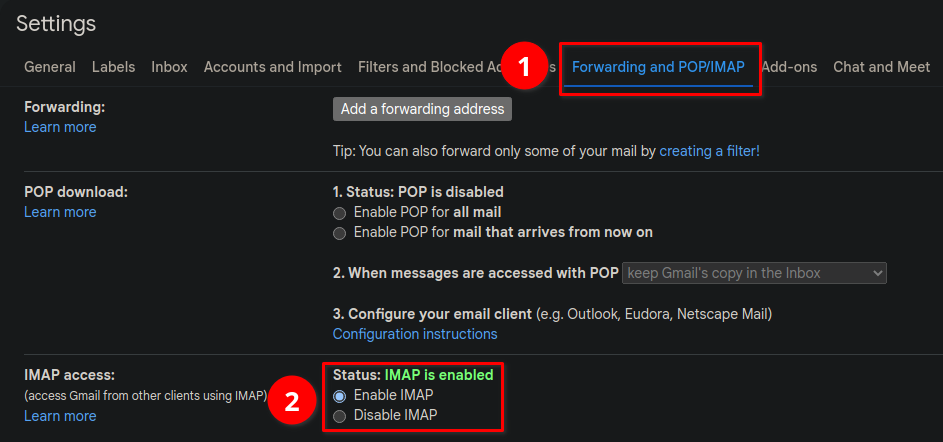
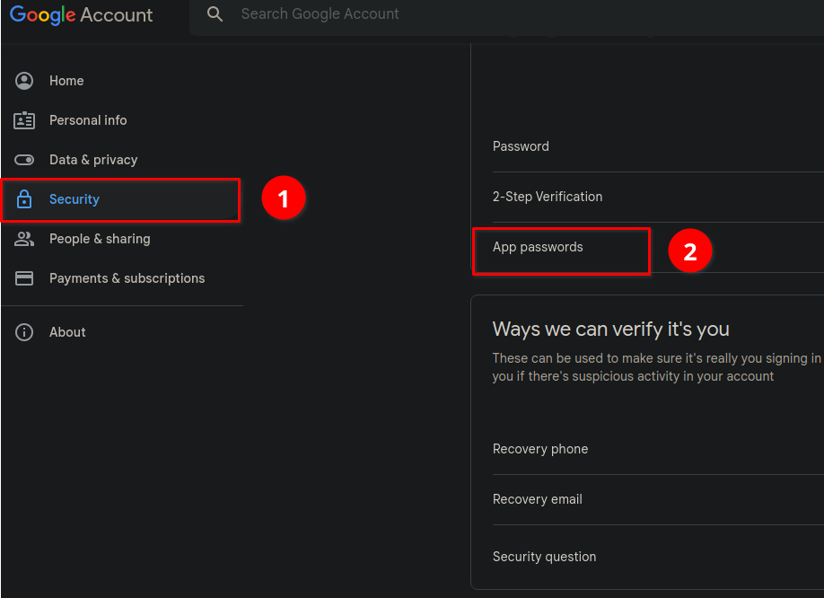
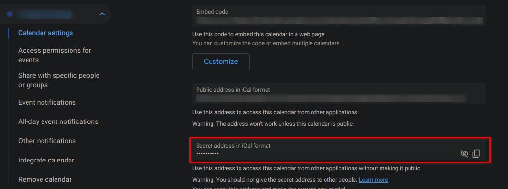

# Google Calendar as Email
## Purpose
The following script downloads a gmail calendar and sends an email containing the events of the current day. 
This can be send automatically every day by setting up a cron task. 
Therefore it is no longer necessary to check the calendar manually and the events are always available in the inbox stored as a readable string.

## Requirements
- ssmtp to send emails

## Setup
1. Allow IMAP in the **Gmail** Settings


2. Assuming Multi-Factor authentication (MFA) is enabled, create a app password to bypass the MFA in the **Google Account** settings for Gmail.


3. Get the GCalendar URL by clicking on the settings in GCalendar and then scroll down to Secret address in ICal format. This is the needed URL.


4. Now the following things should be known:
- email-adress (e.g. john.dalton@gmail.com)
- app password (see step 2)
- GCalendar URL (see step 3)

NOTE: The default settings for Gmail are configured but if you're using a different
mail server the server:port are also required and whether STARTTLS is used.

## Usage
```bash
sh email_calendar.sh
    --url <GCalendar URL> (recommended) 
    OR
    --file <path_to_ics_file>
    -v (optional) verbose mode
    -h (optional) help
```

## What the script does
The script
- downloads the provided ics file from **--url**
- parses the ics file and stores all dates in an array
- stores (in case there is none) a configuration file (*~/.ssmtprc*) and sends the appointments as email with the subject: "Calendar YYYYMMDD" to the email from the mail server

## Limitations
- The script can also parse local ics files, with the command `--file <path_to_file>` but this works only if the events in the ics file are in UTC time, otherwise the events will be shifted by the timezone of the system and the events will be wrong. So for example if the DTSTART property already defines the timezone, the script will not work. The following example will not work:
```
DTSTART;TZID=Europe/Berlin:20221217T170000
DTEND;TZID=Europe/Berlin:20221217T200000
```
- No support for TODOs (yet)
- If the appointment spans multiple days, the appointment will be shown like this `14:00-16:00 | Event (3 days)` therefore it is not possible to see when it will end or when it started, prefer using full day events instead.
